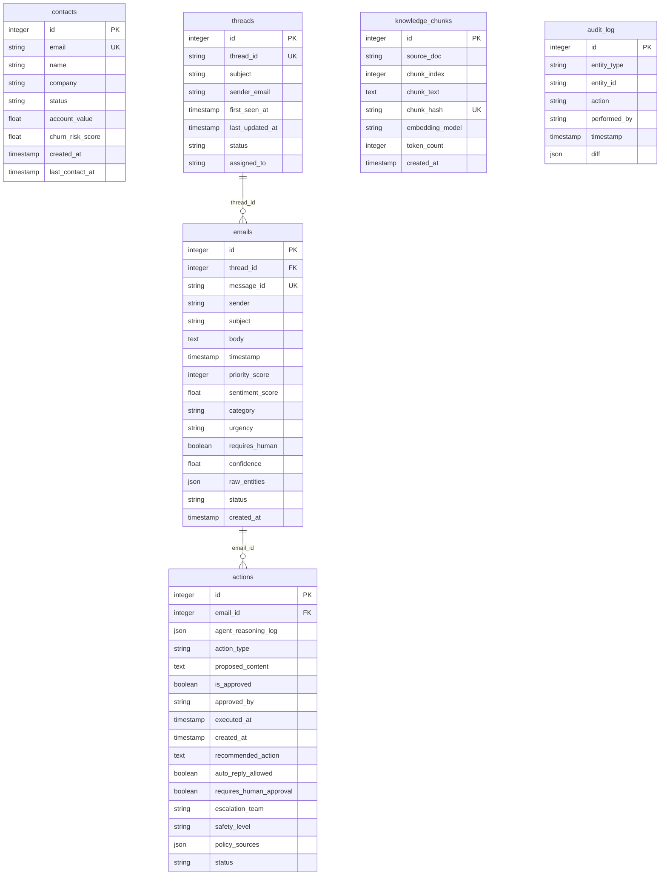

# Database Schema Documentation

This document describes the PostgreSQL database schema for the Agentic CRM Intelligence Platform, detailing the fields, data types, constraints, and relationships.

## 1. Entity-Relationship (ER) Diagram

The following Mermaid diagram visualizes the table schemas and foreign key connections:

---

## 2. Table Specifications

### 2.1. `contacts`
Stores core customer profile parameters, lifecycle states, and metrics.
* **`id`**: `Integer` | Primary Key, Indexed.
* **`email`**: `String` | Unique, Indexed, Nullable=False (Normalized lower-case sender addresses).
* **`name`**: `String` | Nullable=True.
* **`company`**: `String` | Nullable=True.
* **`status`**: `String` | Default="Active" (Lifecycle states: `VIP`, `Blocked`, `Active`, `Churned`).
* **`account_value`**: `Float` | Default=0.0, Nullable=False.
* **`churn_risk_score`**: `Float` | Default=0.0, Nullable=False.
* **`created_at`**: `DateTime` | Server default=func.now(), Nullable=False.
* **`last_contact_at`**: `DateTime` | Nullable=True (Reflects the timestamp of the last incoming email).

### 2.2. `threads`
Groups sequential communications logically.
* **`id`**: `Integer` | Primary Key, Indexed.
* **`thread_id`**: `String` | Unique, Indexed, Nullable=False (External identifier).
* **`subject`**: `String` | Nullable=False.
* **`sender_email`**: `String` | Nullable=False.
* **`first_seen_at`**: `DateTime` | Server default=func.now(), Nullable=False.
* **`last_updated_at`**: `DateTime` | Server default=func.now(), onupdate=func.now(), Nullable=False.
* **`status`**: `String` | Default="Open" (Values: `Open`, `Resolved`, `Escalated`, `Ignored`).
* **`assigned_to`**: `String` | Nullable=True.

### 2.3. `emails`
Chronological records of incoming customer emails.
* **`id`**: `Integer` | Primary Key, Indexed.
* **`thread_id`**: `Integer` | Foreign Key references `threads.id`, Nullable=False.
* **`message_id`**: `String` | Unique, Indexed, Nullable=False (Used to enforce deduplication).
* **`sender`**: `String` | Nullable=False.
* **`subject`**: `String` | Nullable=False.
* **`body`**: `Text` | Nullable=False (Payload truncated if > 10,000 characters).
* **`timestamp`**: `DateTime` | Nullable=False.
* **`priority_score`**: `Integer` | Default=0, Nullable=False (Values range `0` to `3` / `100`).
* **`sentiment_score`**: `Float` | Nullable=True.
* **`category`**: `String` | Nullable=True.
* **`urgency`**: `String` | Nullable=True.
* **`requires_human`**: `Boolean` | Nullable=True.
* **`confidence`**: `Float` | Nullable=True.
* **`raw_entities`**: `JSON` | Nullable=True (Stores structured pre-filter, RAG logs, context chunks, and flags).
* **`status`**: `String` | Default="Received" (Values: `Received`, `Processing`, `Replied`, `Escalated`, `Ignored`, `Spam`).
* **`created_at`**: `DateTime` | Server default=func.now(), Nullable=False.

### 2.4. `actions`
Safe action plans, draft templates, safety metrics, and step traces.
* **`id`**: `Integer` | Primary Key, Indexed.
* **`email_id`**: `Integer` | Foreign Key references `emails.id`, Nullable=False.
* **`agent_reasoning_log`**: `JSON` | Nullable=True (Reasoning traces audit log).
* **`action_type`**: `String` | Nullable=False (Main triage decision/label).
* **`proposed_content`**: `Text` | Nullable=True (AI-drafted email reply).
* **`is_approved`**: `Boolean` | Default=False, Nullable=False.
* **`approved_by`**: `String` | Nullable=True.
* **`executed_at`**: `DateTime` | Nullable=True.
* **`created_at`**: `DateTime` | Server default=func.now(), Nullable=False.
* **`recommended_action`**: `Text` | Nullable=True.
* **`auto_reply_allowed`**: `Boolean` | Default=False, Nullable=False.
* **`requires_human_approval`**: `Boolean` | Default=True, Nullable=False.
* **`escalation_team`**: `String` | Nullable=True (Escalated queues: `security`, `legal`, `compliance`, `billing`, etc.).
* **`safety_level`**: `String` | Nullable=True (Safety classifications: `blocked`, `restricted`, `safe`).
* **`policy_sources`**: `JSON` | Nullable=True (Grounded RAG references citation lists).
* **`status`**: `String` | Default="pending", Nullable=False.

### 2.5. `knowledge_chunks`
Vector store metadata cache tracking seeded policy documents.
* **`id`**: `Integer` | Primary Key, Indexed.
* **`source_doc`**: `String` | Indexed, Nullable=False.
* **`chunk_index`**: `Integer` | Nullable=False.
* **`chunk_text`**: `Text` | Nullable=False.
* **`chunk_hash`**: `String` | Unique, Indexed, Nullable=False.
* **`embedding_model`**: `String` | Nullable=False (Typically `all-MiniLM-L6-v2`).
* **`token_count`**: `Integer` | Nullable=True.
* **`created_at`**: `DateTime` | Server default=func.now(), Nullable=False.

### 2.6. `audit_log`
Chronological audit trail of system operations and pipeline changes.
* **`id`**: `Integer` | Primary Key, Indexed.
* **`entity_type`**: `String` | Nullable=False.
* **`entity_id`**: `String` | Nullable=False.
* **`action`**: `String` | Nullable=False.
* **`performed_by`**: `String` | Nullable=False.
* **`timestamp`**: `DateTime` | Server default=func.now(), Nullable=False.
* **`diff`**: `JSON` | Nullable=True.
