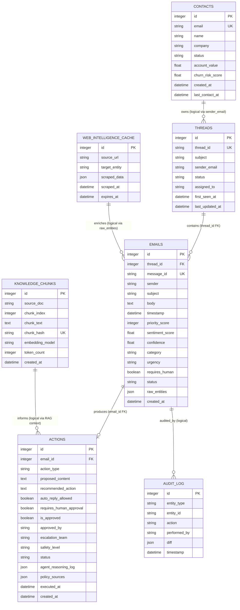

# Database Schema Documentation

This document describes the SQLite/PostgreSQL database schema for the Agentic CRM Intelligence Platform. It covers all seven tables, their column specifications, constraints, relationships, and notes on JSON field contents.

---

## 1. Entity-Relationship (ER) Diagram

The following Mermaid diagram visualises all tables and their relationships.
Relationships marked **(logical)** are enforced by application logic rather than a database-level foreign key constraint.

---

## 2. Table Specifications

### 2.1 `contacts`

Stores core customer profile metadata, lifecycle states, and CRM metrics.

| Column | Type | Constraints | Description |
|---|---|---|---|
| `id` | Integer | PK, Indexed | Auto-increment primary key |
| `email` | String | Unique, Indexed, NOT NULL | Normalized lower-case sender email address |
| `name` | String | Nullable | Customer display name |
| `company` | String | Nullable | Associated company name |
| `status` | String | Default="Active" | Lifecycle state: `Active`, `VIP`, `Blocked`, `Churned` |
| `account_value` | Float | NOT NULL, Default=0.0 | Estimated contract/account value in USD |
| `churn_risk_score` | Float | NOT NULL, Default=0.0 | Churn risk score 0.0-1.0 (higher = more at risk) |
| `created_at` | DateTime | NOT NULL, server_default | UTC timestamp of first contact record creation |
| `last_contact_at` | DateTime | Nullable | UTC timestamp of the most recent incoming email |

**Indexes**: `email` (unique), `id`

---

### 2.2 `threads`

Groups sequential communications into logical email conversations.

| Column | Type | Constraints | Description |
|---|---|---|---|
| `id` | Integer | PK, Indexed | Auto-increment primary key |
| `thread_id` | String | Unique, Indexed, NOT NULL | External thread identifier from ingestion payload |
| `subject` | String | NOT NULL | Subject line of the first email in the thread |
| `sender_email` | String | NOT NULL | Email address of the thread originator |
| `first_seen_at` | DateTime | NOT NULL, server_default | UTC timestamp of thread creation |
| `last_updated_at` | DateTime | NOT NULL, auto-updated | UTC timestamp of the most recent email added |
| `status` | String | Default="Open" | Thread state: `Open`, `Resolved`, `Escalated`, `Ignored` |
| `assigned_to` | String | Nullable | Team or agent assigned to this thread |

**Indexes**: `thread_id` (unique), `id`

---

### 2.3 `emails`

Central table. Stores all incoming customer emails, their classifications, and enrichment metadata.

| Column | Type | Constraints | Description |
|---|---|---|---|
| `id` | Integer | PK, Indexed | Auto-increment primary key |
| `thread_id` | Integer | FK -> `threads.id`, NOT NULL | Links email to its parent thread |
| `message_id` | String | Unique, Indexed, NOT NULL | External message identifier -- deduplication key |
| `sender` | String | NOT NULL | Sender email address (original case preserved) |
| `subject` | String | NOT NULL | Email subject line |
| `body` | Text | NOT NULL | Email body. Truncated to 10,000 chars for AI processing |
| `timestamp` | DateTime | NOT NULL | UTC timestamp from the email payload |
| `priority_score` | Integer | NOT NULL, Default=0 | Heuristic priority score (0-100) |
| `sentiment_score` | Float | Nullable | LLM-derived sentiment: -1.0 (very negative) to +1.0 |
| `confidence` | Float | Nullable | LLM classification confidence 0.0-1.0 |
| `category` | String | Nullable | Heuristic category: `Billing`, `Complaint`, `Legal`, `Security`, `Compliance`, `Spam`, `Internal`, etc. |
| `urgency` | String | Nullable | Urgency level: `Low`, `Medium`, `High`, `Critical` |
| `requires_human` | Boolean | Nullable | True if human review is required |
| `status` | String | Default="Received" | Processing state: `Received`, `Processing`, `Escalated`, `Spam`, `Ignored`, `Replied` |
| `raw_entities` | JSON | Nullable | Structured enrichment blob (see JSON fields below) |
| `created_at` | DateTime | NOT NULL, server_default | UTC timestamp of record insertion |

**Indexes**: `message_id` (unique), `thread_id`, `id`

**`raw_entities` JSON field key contents:**
- `routing_queue` -- heuristic routing target
- `security_flag`, `legal_flag`, `is_spam`, `is_internal` -- boolean safety flags
- `escalation_reason` -- string explanation for escalation
- `heuristic_result` -- full heuristic classifier output object
- `rag_used`, `rag_query`, `rag_context` -- RAG pipeline metadata and top-K chunks
- `llm_classification` -- structured LLM classification output (category, sentiment, entities)
- `prompt_snapshot` -- prompt sent to LLM for audit
- `web_intelligence_used` -- boolean trigger flag
- `web_intelligence` -- full reputation intelligence response object
- `market_intelligence_block` -- one-line public sentiment summary
- `agent_decision`, `auto_reply_allowed`, `requires_human_approval`, `escalation_team`, `safety_level` -- triage agent output
- `agent_action_id` -- integer FK to actions table

---

### 2.4 `actions`

Safe CRM action plans generated by the triage agent for each email.

| Column | Type | Constraints | Description |
|---|---|---|---|
| `id` | Integer | PK, Indexed | Auto-increment primary key |
| `email_id` | Integer | FK -> `emails.id`, NOT NULL | Links to the source email |
| `action_type` | String | NOT NULL | Primary triage decision label |
| `proposed_content` | Text | Nullable | AI-drafted reply template |
| `recommended_action` | Text | Nullable | Human-readable next-action summary |
| `auto_reply_allowed` | Boolean | NOT NULL, Default=False | Whether auto-reply is permitted |
| `requires_human_approval` | Boolean | NOT NULL, Default=True | Whether a human must approve before sending |
| `is_approved` | Boolean | NOT NULL, Default=False | Whether the action has been approved |
| `approved_by` | String | Nullable | Approver identifier |
| `escalation_team` | String | Nullable | Routing target: `security`, `legal`, `compliance`, `billing`, `customer_success`, `support` |
| `safety_level` | String | Nullable | Safety classification: `blocked`, `restricted`, `safe` |
| `status` | String | NOT NULL, Default="pending" | Action lifecycle: `pending`, `approved`, `executed`, `cancelled` |
| `agent_reasoning_log` | JSON | Nullable | Step-by-step reasoning trace array |
| `policy_sources` | JSON | Nullable | RAG policy citation list |
| `executed_at` | DateTime | Nullable | UTC timestamp when the action was executed |
| `created_at` | DateTime | NOT NULL, server_default | UTC timestamp of action plan creation |

**`agent_reasoning_log` JSON structure** (array of steps):
- `step` -- integer step number
- `finding` -- what was observed at this step
- `policy_applied` -- policy rule referenced
- `decision` -- action taken

---

### 2.5 `knowledge_chunks`

Metadata cache for policy document chunks seeded into the ChromaDB vector store.

| Column | Type | Constraints | Description |
|---|---|---|---|
| `id` | Integer | PK, Indexed | Auto-increment primary key |
| `source_doc` | String | Indexed, NOT NULL | Source markdown filename (e.g. `sla_policy.md`) |
| `chunk_index` | Integer | NOT NULL | Zero-based position of this chunk within the source document |
| `chunk_text` | Text | NOT NULL | Raw text content of the chunk |
| `chunk_hash` | String | Unique, Indexed, NOT NULL | SHA-256 hash of chunk text -- prevents re-seeding duplicates |
| `embedding_model` | String | NOT NULL | Model used for embedding (default: `all-MiniLM-L6-v2`) |
| `token_count` | Integer | Nullable | Approximate token count of the chunk |
| `created_at` | DateTime | NOT NULL, server_default | UTC timestamp of seeding |

> Note: The actual vector embeddings live in ChromaDB (`chroma_db/`), not in this table. This table acts as a seeding registry to prevent duplicate chunk ingestion.

---

### 2.6 `audit_log`

Append-only chronological audit trail of system operations, pipeline events, and errors.

| Column | Type | Constraints | Description |
|---|---|---|---|
| `id` | Integer | PK, Indexed | Auto-increment primary key |
| `entity_type` | String | NOT NULL | Type of entity being audited (e.g. `email`) |
| `entity_id` | String | NOT NULL | Identifier of the entity (e.g. the email's `id`) |
| `action` | String | NOT NULL | Operation performed (e.g. `ingested`, `rag_failed`, `escalated`) |
| `performed_by` | String | NOT NULL | Actor -- typically `system` for automated pipeline events |
| `diff` | JSON | Nullable | Snapshot of state change or error detail at event time |
| `timestamp` | DateTime | NOT NULL, server_default | UTC timestamp of the audit event |

---

### 2.7 `web_intelligence_cache`

Persistent cache for offline/mock public reputation intelligence data with a 6-hour TTL.

| Column | Type | Constraints | Description |
|---|---|---|---|
| `id` | Integer | PK, Indexed | Auto-increment primary key |
| `source_url` | String | Nullable | Source descriptor -- `offline_mock_reputation_intelligence` in safe offline mode |
| `target_entity` | String | Indexed, NOT NULL | Company domain or name queried (e.g. `retail-co.com`) |
| `scraped_data` | JSON | Nullable | Full reputation payload (see below) |
| `scraped_at` | DateTime | NOT NULL, server_default | UTC timestamp when the record was created/refreshed |
| `expires_at` | DateTime | NOT NULL | UTC expiry timestamp (`scraped_at + 6 hours`) |

**`scraped_data` JSON field key contents:**
- `g2_rating` -- G2 crowd-sourced rating (float)
- `trustpilot_rating` -- Trustpilot rating (float)
- `capterra_rating` -- Capterra rating (float)
- `recent_review_count` -- number of recent reviews (integer)
- `common_complaints` -- array of recurring negative theme strings
- `competitor_rating` -- object mapping competitor names to ratings
- `summary` -- one-line public sentiment summary

**Cache semantics**: `get_reputation_intelligence()` queries for a non-expired record (`expires_at > now()`). On cache miss it writes a new mock record and calls `db.commit()` to ensure cross-session visibility.

---

## 3. Relationship Summary

| Relationship | Type | Enforcement |
|---|---|---|
| `contacts` -> `threads` | One-to-many | Application (logical via `sender_email` match) |
| `threads` -> `emails` | One-to-many | DB FK: `emails.thread_id -> threads.id` |
| `emails` -> `actions` | One-to-one | DB FK: `actions.email_id -> emails.id` |
| `emails` -> `audit_log` | One-to-many | Application (logical via `entity_id = email.id`) |
| `knowledge_chunks` -> `actions` | Many-to-many | Logical (RAG context stored in `emails.raw_entities.rag_context`) |
| `web_intelligence_cache` -> `emails` | One-to-many | Logical (result written to `emails.raw_entities.web_intelligence`) |

---

## 4. Performance Notes

- All primary keys are indexed automatically by SQLAlchemy.
- `emails.message_id` and `threads.thread_id` carry unique constraints to enable O(1) deduplication lookups.
- `knowledge_chunks.chunk_hash` uniqueness prevents duplicate seeding without requiring full table scans.
- `web_intelligence_cache.target_entity` is indexed for fast reputation lookups during ingestion.
- JSON columns (`raw_entities`, `agent_reasoning_log`, `policy_sources`, `scraped_data`, `diff`) are stored natively in SQLite; in PostgreSQL they leverage `jsonb` for filtered queries.

---

## 5. Data Retention / Audit Notes

- `audit_log` is **append-only** -- records are never deleted by the application.
- `emails.body` is truncated at 10,000 characters before AI processing; the full body is preserved in the database.
- `web_intelligence_cache` records expire after 6 hours (`expires_at`). Expired records are not auto-deleted; they are superseded by fresh records on the next cache miss.
- No soft-delete pattern is implemented. Logical deletes (e.g. spam archiving) are handled via the `status` field.
- All datetime columns store UTC timestamps. The frontend converts to local time for display.
